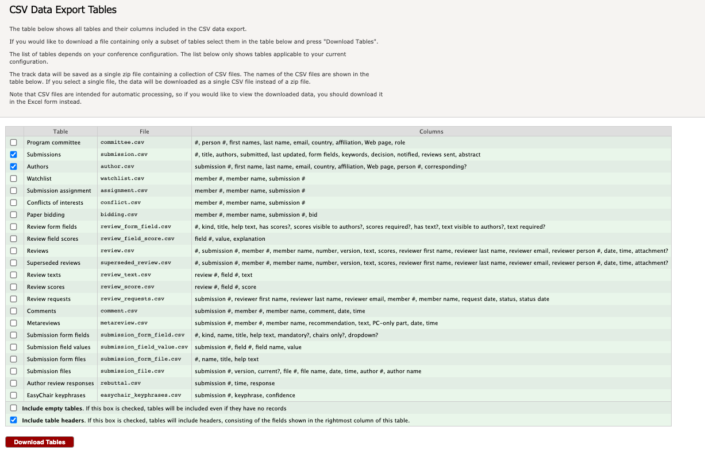

 # easychair-to-acm-erights

Scripts and instructions for converting ACM-BCB EasyChair submissions into ACM eRights metadata.  Chairs and organizers must convert their metadata information into an XML or CSV file for uploading to ACM.  

## 2021 ACM-BCB Instructions

1. **Download Data from EasyChair** for each track. Download a submission table and the authors table using the Premium tab on EasyChair; deselect "include empty tables" and select "include table headers":

2. **Generate a CSV file** of author metadata.  ACM now uses an [enhanced CSV format](https://www.acm.org/publications/gi-proceedings-current). The columns are:

- proceeding ID
- event_tracking_number/theirnumber
- paper_type
- theTitle
- prefix
- first_name
- middle_name
- last_name
- suffix
- author_sequence_no
- contact_author
- ACM_profile_id
- ACM_client_no
- orcid
- email
- department_school_lab
- institution / AFFILIATION
- city
- state_province
- country
- secondary_department_school_lab
- secondary_institution
- secondary_city
- secondary_state_province
- secondary_country
- section_title
- section_seq_no
- published_article_number
- start_page
- end_page
- article_seq_no

Other notes from the instructions: _Be sure to include the correct section and article sequence information in your XML or CSV file. If this data is not available upon initial file load, please reupload the file when the data becomes available._

This current formatting for the ACM copyrights grid **does not include section or article sequence information.** This has to be done after the schedule is set - we need to return to this.

### Using `convert.py`
The `convert.py` script takes the track number and the two downloaded files and generates the enhanced CSV. See the instructions in the sub-directories.

3. **Send the CSV file to Conference Catalysts** (Kaylin Kolodziejczak, kkolodziejczak@conferencecatalysts.com). Kaylin and Conference Catalysts will upload the file, review the grid, and send automated notifications for authors.  They will also monitor copyright submission status on a weekly basis.

## Instructions from Previous Years

[2020 ACM-BCB Instructions](https://github.com/annaritz/easychair-to-acm-erights/tree/master/2020-ACM-BCB)

**Notes from previous chairs:**  Mindy Shi and Yang Shen have been the Proceedings Chairs for numerous ACM-BCB conferences prior to 2020.  The script `convert.py` was initially developed by one of Yang Shen's students, Di Wu.  From that README document: if the outputted CSV file needs to be converted to `.xlsx`, please use google excel sheet to open and download otherwise special characters may be wrong.
